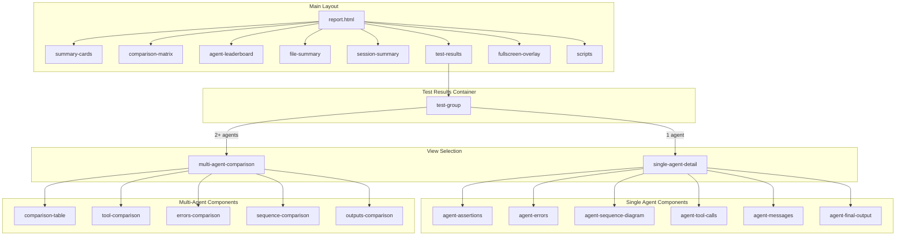
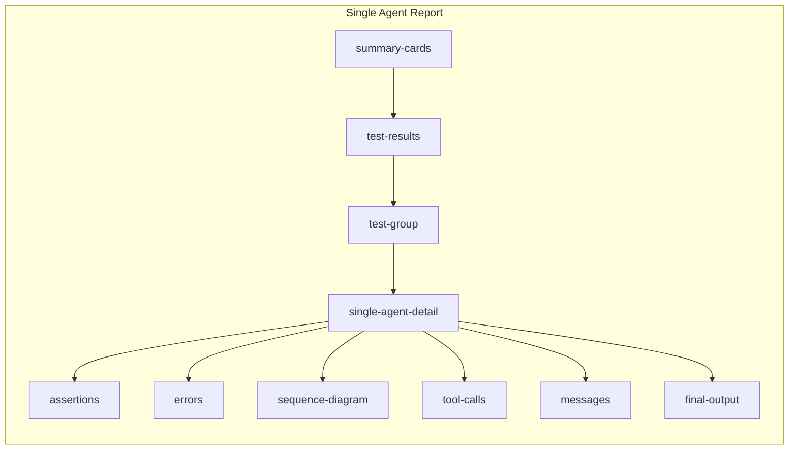
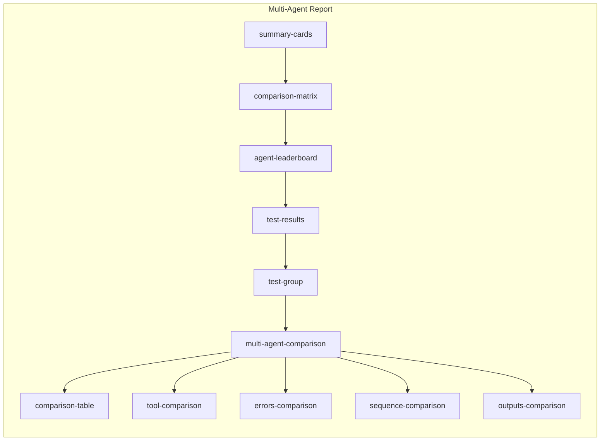
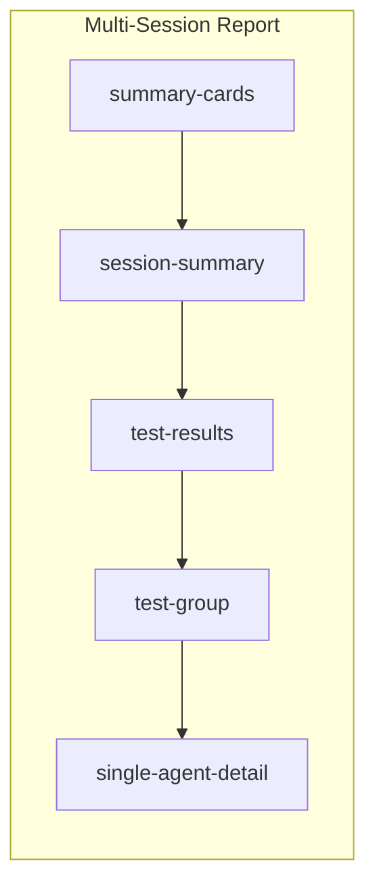
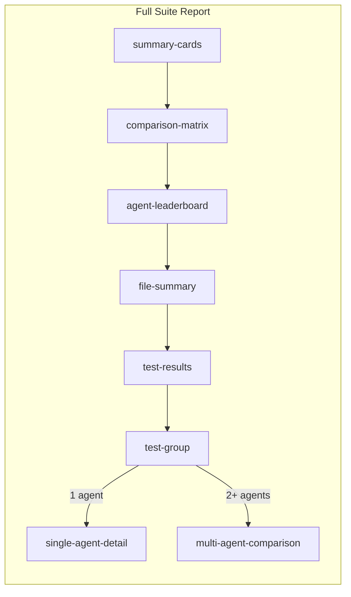

# agent-benchmark Documentation

**agent-benchmark** is a comprehensive testing framework for AI agents built on the Model Context Protocol (MCP). It enables systematic testing, validation, and benchmarking of AI agents across different LLM providers with robust assertion capabilities.

---

## Table of Contents

1. [Overview](#overview)
2. [Key Features](#key-features)
3. [Installation](#installation)
4. [Command Line Reference](#command-line-reference)
5. [Configuration](#configuration)
6. [Test/Suite Definition](#testsuite-definition)
7. [Assertions](#assertions)
8. [Template System](#template-system)
9. [Data Extraction](#data-extraction)
10. [Reports](#reports)
11. [Usage Examples](#usage-examples)
12. [Best Practices](#best-practices)
13. [Troubleshooting](#troubleshooting)
14. [CI/CD Integration](#cicd-integration)
15. [Architecture Notes](#architecture-notes)
16. [Contributing](#contributing)

---

## Overview

agent-benchmark provides a declarative YAML-based approach to testing AI agents that interact with MCP servers. It supports multiple LLM providers, various MCP server types, and comprehensive assertion mechanisms to validate agent behavior.

---

## Key Features

### 1. Multi-Provider Support
Test agents across different LLM providers in parallel:
- **Google AI** (Gemini models)
- **Vertex AI** (Google Cloud Gemini)
- **Anthropic** (Claude models)
- **OpenAI** (GPT models)
- **Azure OpenAI**
- **Groq**

### 2. MCP Server Integration
Connect to MCP servers via:
- **stdio**: Run MCP servers as local processes
- **SSE**: Connect to remote MCP servers via Server-Sent Events

### 3. Session-Based Testing
Organize tests into sessions with shared context and message history, simulating real conversational flows.

### 4. Test Suite Support
Run multiple test files with centralized configuration, shared variables, and unified success criteria.

### 5. Rich Assertion Library
Validate agent behavior with 20+ assertion types covering:
- Tool usage patterns
- Output validation
- Performance metrics
- Boolean combinators (anyOf, allOf, not) for complex logic

### 6. Template Engine
Dynamic test generation with Handlebars-style templates supporting:
- Random data generation
- Timestamp manipulation
- Faker integration
- String manipulation

### 7. Data Extraction
Extract data from tool results using JSONPath to pass between tests in a session.

### 8. Comprehensive Reporting
Generate reports in multiple formats:
- Console output with color-coded results
- HTML reports with performance comparison
- JSON export
- Markdown documentation

---

## Installation

### Quick Install (Recommended)

Install the latest version with a single command:

**Linux/macOS:**
```bash
curl -fsSL https://raw.githubusercontent.com/mykhaliev/agent-benchmark/master/install.sh | bash
```

**Windows (PowerShell):**
```powershell
irm https://raw.githubusercontent.com/mykhaliev/agent-benchmark/master/install.ps1 | iex
```

### Alternative Installation Methods

<details>
<summary><b>Minimal Install (60-70% smaller download)</b></summary>

For slower connections or to save bandwidth, use the UPX-compressed version:
```bash
curl -fsSL https://raw.githubusercontent.com/mykhaliev/agent-benchmark/master/install-min.sh | bash
```

**Note:** The minimal version may trigger antivirus warnings on some systems as UPX compression is sometimes flagged by security software.

</details>

<details>
<summary><b>Manual Installation from Pre-built Binaries</b></summary>

Download the appropriate file for your system from the [releases page](https://github.com/mykhaliev/agent-benchmark/releases):

**Regular versions (recommended):**
- **Linux (AMD64):** `agent-benchmark_vX.X.X_linux_amd64.tar.gz`
- **Linux (ARM64):** `agent-benchmark_vX.X.X_linux_arm64.tar.gz`
- **macOS (Intel):** `agent-benchmark_vX.X.X_darwin_amd64.tar.gz`
- **macOS (Apple Silicon):** `agent-benchmark_vX.X.X_darwin_arm64.tar.gz`
- **Windows (AMD64):** `agent-benchmark_vX.X.X_windows_amd64.zip`
- **Windows (ARM64):** `agent-benchmark_vX.X.X_windows_arm64.zip`

**UPX compressed (smaller size, not available for Windows ARM64):**
- **Linux (AMD64):** `agent-benchmark_vX.X.X_linux_amd64_upx.tar.gz`
- **Linux (ARM64):** `agent-benchmark_vX.X.X_linux_arm64_upx.tar.gz`
- **macOS (Intel):** `agent-benchmark_vX.X.X_darwin_amd64_upx.tar.gz`
- **macOS (Apple Silicon):** `agent-benchmark_vX.X.X_darwin_arm64_upx.tar.gz`
- **Windows (AMD64):** `agent-benchmark_vX.X.X_windows_amd64_upx.zip`

Extract and move to your PATH:
```bash
# Linux/macOS
tar -xzf agent-benchmark_*.tar.gz
sudo mv agent-benchmark /usr/local/bin/

# Windows
# Extract the ZIP file and add the binary to your PATH
```

</details>

<details>
<summary><b>Build from Source</b></summary>

Requirements: Go 1.25 or higher

**Linux/macOS:**
```bash
# Clone the repository
git clone https://github.com/mykhaliev/agent-benchmark
cd agent-benchmark

# Build the binary
go build -o agent-benchmark

# (Optional) Move to your PATH
sudo mv agent-benchmark /usr/local/bin/
```

**Windows (PowerShell):**
```powershell
# Clone the repository
git clone https://github.com/mykhaliev/agent-benchmark
cd agent-benchmark

# Build the binary
.\build.ps1
# or
go build -o agent-benchmark.exe
```

</details>

### Verify Installation

After installation, verify it works:
```bash
agent-benchmark -v
```

### Quick Start

Run your first benchmark:
```bash
agent-benchmark -f tests.yaml -o report.html -verbose
```

---

## Command Line Reference

```bash
agent-benchmark [options]

Required (one of):
  -f <file>         Path to test configuration file (YAML)
  -s <file>         Path to suite configuration file (YAML)
  -generate-report <file>  Generate HTML report from existing JSON results file
                           (reads test_file from JSON to load AI summary config)

Optional:
  -o <file>         Output report path/filename without extension
                      Default: <test_dir>/test_results/report
                      The test_results folder is auto-created and git-ignored
  -l <file>         Log file path (default: stdout)
  -reportType <types> Report format(s): html, json, md (default: html)
                      Multiple formats supported as comma-separated values
                      Examples: -reportType html
                                -reportType html,json
                                -reportType html,json,md
  -verbose          Enable verbose logging
  -v                Show version and exit
```

**Examples:**

```bash
# Run single test file with verbose output
# Reports saved to: examples/test_results/report.html
./agent-benchmark -f examples/tests.yaml -verbose

# Run test suite with JSON report (custom output path)
./agent-benchmark -s suite.yaml -o ./my-reports/results -reportType json

# Run with custom log file
./agent-benchmark -f tests.yaml -l test-run.log

# Generate Markdown report
./agent-benchmark -f tests.yaml -o report -reportType md

# Generate HTML report from existing JSON results (fast iteration)
# Reads test_file from JSON to load AI summary configuration
./agent-benchmark -generate-report results.json -o new-report

# Generate both JSON and HTML reports (for later regeneration)
./agent-benchmark -f tests.yaml -o results -reportType json,html
```

---

## Configuration

Configuration files use YAML format with six main sections:

```yaml
providers:    # LLM provider configurations
servers:      # MCP server definitions
agents:       # Agent configurations
sessions:     # Test sessions
settings:     # Global test settings
variables:    # Reusable variables
```

### Test Suite Configuration

The framework supports running multiple test files through a suite configuration:

```yaml
name: "Complete Test Suite"
test_files:
  - tests/basic-operations.yaml
  - tests/advanced-features.yaml
  - tests/edge-cases.yaml

providers:
  - name: gemini
    type: GOOGLE
    token: "{{GOOGLE_API_KEY}}"
    model: gemini-2.0-flash

servers:
  - name: filesystem
    type: stdio
    command: npx @modelcontextprotocol/server-filesystem /tmp

agents:
  - name: test-agent
    provider: gemini
    servers:
      - name: filesystem

settings:
  verbose: true
  max_iterations: 10
  tool_timeout: 30s
  test_delay: 2s

variables:
  base_path: "/tmp/tests"
  timestamp: "{{now format='unix'}}"

criteria:
  success_rate: "0.8"  # 80% of tests must pass
```

**Suite Configuration Benefits:**
- Centralized provider and server definitions
- Shared variables across all test files
- Unified success criteria
- Single command execution for multiple test files

---

## Test/Suite Definition

### Providers

**Provider Types:**
- `GOOGLE` - Google AI (Gemini)
- `VERTEX` - Vertex AI (Google Cloud Gemini)
- `ANTHROPIC` - Anthropic (Claude)
- `OPENAI` - OpenAI (GPT)
- `AZURE` - Azure OpenAI
- `GROQ` - Groq

Define LLM providers for your agents:

```yaml
providers:
  - name: gemini-flash
    type: GOOGLE
    token: {{GOOGLE_API_KEY}}
    model: gemini-2.0-flash
    
  - name: claude-sonnet
    type: ANTHROPIC
    token: {{ANTHROPIC_API_KEY}}
    model: claude-sonnet-4-20250514
    
  - name: gpt-4
    type: OPENAI
    token: {{OPENAI_API_KEY}}
    model: gpt-4o-mini
    baseUrl: https://api.openai.com/v1  # Optional
    
  - name: azure-gpt
    type: AZURE
    token: {{AZURE_API_KEY}}
    model: gpt-4
    baseUrl: https://your-resource.openai.azure.com
    version: 2024-02-15-preview

  - name: azure-entra
    type: AZURE
    auth_type: entra_id  # Use Microsoft Entra ID authentication (passwordless)
    model: gpt-4
    baseUrl: https://your-resource.openai.azure.com
    version: 2024-02-15-preview

  - name: vertex-ai
    type: VERTEX
    project_id: "your-gcp-project-id"
    location: "us-central1"
    credentials_path: "/path/to/service-account.json"
    model: gemini-2.0-flash
    
  - name: gpt-4
    type: GROQ
    token: {{GROQ_API_KEY}}
    model: openai/gpt-oss-120b
    baseUrl: https://api.groq.com/openai/v1 # Optional
```

#### Azure OpenAI Authentication

The AZURE provider supports two authentication methods:

**API Key Authentication (default):**
```yaml
providers:
  - name: azure-apikey
    type: AZURE
    auth_type: api_key  # Optional, this is the default
    token: {{AZURE_OPENAI_API_KEY}}
    model: gpt-4
    baseUrl: https://your-resource.openai.azure.com
    version: 2024-02-15-preview
```

**Microsoft Entra ID Authentication (passwordless):**
```yaml
providers:
  - name: azure-entra
    type: AZURE
    auth_type: entra_id  # Uses DefaultAzureCredential
    model: gpt-4
    baseUrl: https://your-resource.openai.azure.com
    version: 2024-02-15-preview
    # No token required - uses Azure credentials from environment
```

Entra ID authentication uses Azure's `DefaultAzureCredential`, which automatically tries multiple authentication methods in order:
1. **Environment variables**: `AZURE_CLIENT_ID`, `AZURE_TENANT_ID`, `AZURE_CLIENT_SECRET`
2. **Workload Identity** (for Kubernetes)
3. **Managed Identity** (when running in Azure)
4. **Azure CLI** (`az login`)
5. **Azure Developer CLI** (`azd auth login`)
6. **Azure PowerShell** (`Connect-AzAccount`)

**Required RBAC Role:**

Your identity must have the **"Cognitive Services OpenAI User"** role (or higher) assigned on the Azure OpenAI resource. Without this role, you will receive a 401 Unauthorized error.

To assign the role using Azure CLI:
```bash
# Get your Azure OpenAI resource ID
az cognitiveservices account show \
  --name <your-openai-resource-name> \
  --resource-group <your-resource-group> \
  --query id -o tsv

# Assign the required role
az role assignment create \
  --assignee <your-email-or-principal-id> \
  --role "Cognitive Services OpenAI User" \
  --scope <resource-id-from-above>
```

> **Note:** Role assignments can take up to 5-10 minutes to propagate.

For more information, see [Azure Identity authentication](https://learn.microsoft.com/en-us/azure/developer/go/sdk/authentication/credential-chains) and [Azure OpenAI RBAC roles](https://learn.microsoft.com/en-us/azure/ai-services/openai/how-to/role-based-access-control).

#### Rate Limiting

Providers can be configured with rate limits to proactively throttle requests and avoid exceeding API quotas:

```yaml
providers:
  - name: azure-gpt
    type: AZURE
    token: {{AZURE_API_KEY}}
    model: gpt-4
    baseUrl: https://your-resource.openai.azure.com
    version: 2024-02-15-preview
    rate_limits:
      tpm: 30000               # Tokens per minute limit (proactive throttling)
      rpm: 60                  # Requests per minute limit (proactive throttling)
```

**Rate Limit Configuration Options:**

| Option | Description | Default |
|--------|-------------|---------|
| `tpm` | Maximum tokens per minute | No limit |
| `rpm` | Maximum requests per minute | No limit |

**Behavior:**
- When rate limits are configured, the framework uses a token bucket algorithm to proactively limit request rates
- This prevents hitting provider rate limits by throttling requests before they're sent
- Rate limiting is applied per-provider, allowing different limits for different API endpoints

#### 429 Retry Handling

By default, 429 (Too Many Requests) errors are treated as regular errors and cause the test to fail immediately. If you want to retry on 429 errors, you can configure this separately:

```yaml
providers:
  - name: azure-gpt
    type: AZURE
    token: {{AZURE_API_KEY}}
    model: gpt-4
    baseUrl: https://your-resource.openai.azure.com
    version: 2024-02-15-preview
    rate_limits:
      tpm: 30000               # Proactive rate limiting
      rpm: 60
    retry:
      retry_on_429: true       # Enable retry on 429 errors (default: false)
      max_retries: 3           # Max retry attempts (default: 3 when enabled)
```

**Retry Configuration Options:**

| Option | Description | Default |
|--------|-------------|---------|
| `retry_on_429` | Enable automatic retry when receiving 429 errors | `false` |
| `max_retries` | Number of retry attempts for 429 errors | 3 (when enabled) |

**Behavior:**
- By default, 429 errors fail immediately (no retry)
- When `retry_on_429: true` is set, the framework will retry with exponential backoff
- The framework extracts the wait duration from:
  1. **HTTP `Retry-After` header** (preferred) - parsed as seconds or HTTP-date
  2. **Error message text** (fallback) - e.g., "retry after 30 seconds"
- A 1-second buffer is added to ensure we're past the rate limit window

> **Note:** Rate limiting (proactive throttling) and 429 retry handling (reactive recovery) are separate concepts. You can use either or both depending on your needs

---

### Servers

Configure MCP servers that agents will interact with:

#### Local/Stdio Server

```yaml
servers:
  - name: filesystem-server
    type: stdio
    command: npx @modelcontextprotocol/server-filesystem /tmp
```

#### SSE Server

```yaml
servers:
  - name: remote-api
    type: sse
    url: https://api.example.com/mcp/events
    headers:
      - "Authorization: Bearer {{API_TOKEN}}"
      - "X-Custom-Header: value"
```

**Server Types:**
- `stdio` - Standard Input/Output communication
- `sse` - Server-Sent Events over HTTP

#### Server Timing Configuration

Control server initialization and process delays:

```yaml
servers:
  - name: slow-server
    type: stdio
    command: python server.py
    server_delay: 45s      # Wait up to 45s for initialization
    process_delay: 1s      # Wait 1s after process starts
```

**Delay Parameters:**
- `server_delay` - Maximum time to wait for server initialization (default: 30s)
- `process_delay` - Delay after starting process before initialization (default: 300ms)

#### SSE Server with Authentication

```yaml
servers:
  - name: authenticated-api
    type: sse
    url: https://api.example.com/mcp/sse
    headers:
      - "Authorization: Bearer {{API_TOKEN}}"
      - "X-API-Version: 2024-01"
      - "X-Client-ID: agent-benchmark"
```

---

### Agents

Define agents that combine providers with MCP servers:

```yaml
agents:
  - name: research-agent
    provider: gemini-flash
    system_prompt: |
      You are an autonomous research agent.
      Execute tasks directly without asking for clarification.
      Use available tools to complete the requested tasks.
    servers:
      - name: filesystem-server
        allowedTools:  # Optional: restrict tool access
          - read_file
          - list_directory
      - name: remote-api
        
  - name: coding-agent
    provider: claude-sonnet
    servers:
      - name: filesystem-server  # No tool restrictions
```

**Agent Configuration:**
- `name` - Unique agent identifier
- `provider` - Reference to provider name
- `system_prompt` - Optional system prompt prepended to all conversations (supports templates)
- `servers` - List of MCP servers
- `allowedTools` - Optional tool whitelist per server

**System Prompt Templates:**

The `system_prompt` field supports template variables for dynamic context:
- `{{AGENT_NAME}}` - Current agent name
- `{{SESSION_NAME}}` - Current session name  
- `{{PROVIDER_NAME}}` - Provider name being used

Example:
```yaml
agents:
  - name: test-agent
    provider: gemini-flash
    system_prompt: |
      You are {{AGENT_NAME}} using {{PROVIDER_NAME}}.
      Currently running session: {{SESSION_NAME}}.
      Execute all tasks autonomously.
```

---

### Sessions

Organize tests into sessions with shared conversational context:

```yaml
sessions:
  - name: File Operations
    tests:
      - name: Create a file
        prompt: "Create a file called {{filename}} with content: Hello World"
        assertions:
          - type: tool_called
            tool: write_file
            
      - name: Read the file
        prompt: "Read the file {{filename}}"
        assertions:
          - type: tool_called
            tool: read_file
          - type: output_contains
            value: "Hello World"
```

**Session Features:**
- Tests within a session share message history
- Variables persist across tests in a session
- Simulates multi-turn conversations

---

### Settings

Global configuration for test execution:

```yaml
settings:
  verbose: true                 # Enable detailed logging
  max_iterations: 10            # Maximum agent reasoning loops
  timeout: 30s                  # Tool execution timeout (legacy, use tool_timeout)
  tool_timeout: 30s             # Tool execution timeout
  test_delay: 2s                # Delay between tests
  session_delay: 30s            # Delay between sessions (for COM cleanup, resource release)
  variable_policy: suite_only   # Controls are combined (test-only, suite-only, merge-test-priority, merge-suite-priority)
```
---

#### Variable Policy

When running tests as part of a **test suite**, variables can be defined at both
the **suite level** and the **test level**.

The `variable_policy` setting controls how these variables are resolved.

Available Policies

| Policy | Description |
|------|-------------|
| `suite-only` *(default)* | Only suite-level variables are used. Test-level variables are ignored. |
| `test-only` | Only test-level variables are used. Suite-level variables are ignored. |
| `merge-test-priority` | Suite and test variables are merged. Test variables override suite variables on key conflicts. |
| `merge-suite-priority` | Suite and test variables are merged. Suite variables override test variables on key conflicts. |

If `variable_policy` is not set or has an unknown value, it defaults to `suite-only`.

---

### Variables

Define reusable variables with template support:

```yaml
variables:
  filename: "test-{{randomValue type='ALPHANUMERIC' length=8}}.txt"
  timestamp: "{{now format='unix'}}"
  user_id: "{{randomInt lower=1000 upper=9999}}"
  email: "{{faker 'Internet.email'}}"
```

Variables can:
- Use template helpers
- Reference environmental variables

---

### Test Timing Controls

#### Start Delay

Delay individual test execution:

```yaml
tests:
  - name: Rate-limited API call
    prompt: "Make API request"
    start_delay: 5s  # Wait 5 seconds before starting
    assertions:
      - type: tool_called
        tool: api_request
```

#### Global Test Delay

Pause between all tests:

```yaml
settings:
  test_delay: 2s  # 2 second pause after each test
```

**Use Cases:**
- Respect API rate limits
- Allow system state to settle
- Prevent resource exhaustion

#### Session Delay

Pause between sessions to allow resource cleanup:

```yaml
settings:
  session_delay: 30s  # 30 second pause between sessions
```

**Use Cases:**
- Allow external applications and resources to fully release between sessions
- Prevent resource contention when tests interact with stateful applications
- Avoid lingering processes from previous sessions affecting new sessions
- Give MCP servers time to cleanly shut down between sessions

---

### Test Criteria & Exit Codes

Define minimum success rate for test suites:

```yaml
criteria:
  success_rate: 0.75  # 75% pass rate required
```

**Exit Code Behavior:**

| Scenario                                | Exit Code |
|-----------------------------------------|-----------|
| All tests pass / Success rate met       | 0         |
| Some tests fail / Success rate not met  | 1         |

---

### Environment Variables

Reference environment variables in configuration:

```yaml
providers:
  - name: claude
    type: ANTHROPIC
    token: "{{ANTHROPIC_API_KEY}}"
    model: claude-sonnet-4-20250514

servers:
  - name: api-server
    type: sse
    url: "{{API_BASE_URL}}"
    headers:
      - "Authorization: Bearer {{API_TOKEN}}"

variables:
  workspace: "{{WORKSPACE_PATH}}"
```

**Convention:**
- Use `{{VAR_NAME}}` syntax
- Set before running tests
- Common for tokens, URLs, paths

```bash
export ANTHROPIC_API_KEY="sk-ant-..."
export API_BASE_URL="https://api.example.com"
export WORKSPACE_PATH="/tmp/workspace"

./agent-benchmark -f tests.yaml
```

---

### Built-in Template Variables

The framework provides built-in variables that are automatically available in template contexts. Variables are divided into two categories based on when they become available:

#### Variable Categories

| Category | Available In | Description |
|----------|--------------|-------------|
| **Static** | Everywhere (providers, servers, variables, prompts, assertions) | Available at configuration load time |
| **Runtime** | Prompts, assertions, system prompts | Available during test execution only |

#### Static Variables (Available Everywhere)

These variables can be used in server commands, provider configs, user variables, prompts, and assertions:

| Variable | Description |
|----------|-------------|
| `{{TEST_DIR}}` | Absolute path to the directory containing the test YAML file |
| `{{TEMP_DIR}}` | System temporary directory (cross-platform: `%TEMP%` on Windows, `/tmp` on Linux/macOS) |
| `{{RUN_ID}}` | Unique UUID v4 for this test run (e.g., `550e8400-e29b-41d4-a716-446655440000`) |
| `{{ANY_ENV_VAR}}` | Any environment variable (e.g., `{{HOME}}`, `{{AZURE_OPENAI_ENDPOINT}}`) |
| User-defined variables | Variables defined in the `variables:` section of your config |

#### Runtime Variables (Available During Test Execution)

These variables are only available in prompts, assertions, and system prompts—not in server commands or provider configs:

| Variable | Description |
|----------|-------------|
| `{{AGENT_NAME}}` | Current agent name |
| `{{SESSION_NAME}}` | Current session name |
| `{{PROVIDER_NAME}}` | Provider name being used |

**Using TEST_DIR for Portable Paths:**

`{{TEST_DIR}}` enables test configurations that work regardless of where the repository is cloned:

```yaml
variables:
  # Paths relative to the test file location
  data_dir: "{{TEST_DIR}}/test-data"
  output_dir: "{{TEST_DIR}}/../TestResults"
  mcp_server: "{{TEST_DIR}}/bin/my-server.exe"

servers:
  - name: filesystem
    type: stdio
    command: npx @modelcontextprotocol/server-filesystem {{output_dir}}

  - name: custom-server
    type: stdio
    command: "{{mcp_server}}"

sessions:
  - name: File Tests
    tests:
      - name: Process test data
        prompt: "Read files from {{data_dir}} and save results to {{output_dir}}"
```

---

## Assertions

agent-benchmark provides 20+ assertion types to validate agent behavior:

### Tool Assertions

#### no_hallucinated_tools
Verify agent only uses available tools:

```yaml
assertions:
  - type: no_hallucinated_tools
```

#### tool_called
Verify a specific tool was invoked:

```yaml
assertions:
  - type: tool_called
    tool: create_file
```

#### tool_not_called
Ensure a tool was NOT invoked:

```yaml
assertions:
  - type: tool_not_called
    tool: delete_database
```

#### tool_call_count
Validate the exact number of tool calls. The tool name is optional; if it is not specified, the number of all tool calls will be verified:

```yaml
assertions:
  - type: tool_call_count
    tool: search_api
    count: 3
```

#### tool_call_order
Verify tools were called in a specific sequence:

```yaml
assertions:
  - type: tool_call_order
    sequence:
      - validate_input
      - process_data
      - save_results
```

#### tool_param_equals
Check tool parameters match exactly:

```yaml
assertions:
  - type: tool_param_equals
    tool: create_user
    params:
      name: "John Doe"
      age: 30
      email: "john@example.com"
      settings.theme: "dark"  # Nested parameter with dot notation
```

**Nested Parameter Validation:**

Use dot notation for nested parameters:

```yaml
assertions:
  - type: tool_param_equals
    tool: create_resource
    params:
      name: "test-resource"
      config.timeout: "30"
      config.retry.max_attempts: "3"
      config.retry.backoff: "exponential"
      metadata.tags.environment: "production"
```

**Dot Notation Rules:**
- Navigate nested maps with dots
- Validate deeply nested values
- Compare exact matches at any depth

#### tool_param_matches_regex
Validate parameters with regex patterns:

```yaml
assertions:
  - type: tool_param_matches_regex
    tool: send_email
    params:
      recipient: "^[a-zA-Z0-9._%+-]+@[a-zA-Z0-9.-]+\\.[a-zA-Z]{2,}$"
```

#### tool_result_matches_json
Validate tool results using JSONPath:

```yaml
assertions:
  - type: tool_result_matches_json
    tool: get_user
    path: "$.data.user.name"
    value: "John Doe"
```

---

### Output Assertions

#### output_contains
Check if output contains specific text:

```yaml
assertions:
  - type: output_contains
    value: "Operation completed successfully"
```

#### output_not_contains
Ensure output doesn't contain specific text:

```yaml
assertions:
  - type: output_not_contains
    value: "error"
```

#### output_regex
Validate output with regex pattern:

```yaml
assertions:
  - type: output_regex
    pattern: "^User ID: [0-9]{4,}$"
```

---

### Performance Assertions

#### max_tokens
Limit approximate token usage:

```yaml
assertions:
  - type: max_tokens
    value: 1000
```

**Token Estimation:**

Token usage for OpenAI, Google and Anthropic models is taken from GenerationInfo
For other models formula is:
```
tokens = output_length / 4
```

This approximation:
- Provides rough token counts
- Useful for max_tokens assertions
- Not exact (varies by tokenizer)

#### max_latency_ms
Ensure execution completes within time limit:

```yaml
assertions:
  - type: max_latency_ms
    value: 5000  # 5 seconds
```

---

### Error Assertions

#### no_error_messages
Verify execution completed without errors:

```yaml
assertions:
  - type: no_error_messages
```

#### no_rate_limit_errors
Verify the test did not encounter any HTTP 429 rate limit errors:

```yaml
assertions:
  - type: no_rate_limit_errors
```

This assertion checks if the provider returned any 429 errors during execution. It's useful for:
- Ensuring tests stay within API quotas
- Validating that rate limit configuration is adequate
- Detecting when throttling is needed

---

### Behavior Assertions

#### no_clarification_questions
Verify the agent executed tasks directly without asking for clarification. Requires [`clarification_detection`](docs/clarification-detection.md) to be enabled on the agent:

```yaml
assertions:
  - type: no_clarification_questions
```

---

### Boolean Combinators

Boolean combinators allow you to create complex assertion logic using JSON Schema-style operators. These are useful when LLMs may achieve the same outcome through different approaches.

#### anyOf
Pass if **ANY** child assertion passes (OR logic):

```yaml
assertions:
  # Pass if the LLM used keyboard_control OR ui_automation
  - anyOf:
      - type: tool_called
        tool: keyboard_control
      - type: tool_called
        tool: ui_automation
```

#### allOf
Pass if **ALL** child assertions pass (AND logic):

```yaml
assertions:
  # Pass if both conditions are met
  - allOf:
      - type: tool_called
        tool: create_file
      - type: output_contains
        value: "File created successfully"
```

#### not
Pass if the child assertion **FAILS** (negation):

```yaml
assertions:
  # Pass if output does NOT contain "error" (equivalent to output_not_contains)
  - not:
      type: output_contains
      value: "error"
```

#### Nested Combinators
Combinators can be nested for complex logic:

```yaml
assertions:
  # Pass if: (keyboard OR ui_automation) AND no errors
  - allOf:
      - anyOf:
          - type: tool_called
            tool: keyboard_control
          - type: tool_called
            tool: ui_automation
      - type: no_error_messages
  
  # Pass if NOT (error in output AND failed tool)
  - not:
      allOf:
        - type: output_contains
          value: "error"
        - type: tool_not_called
          tool: success_handler
```

**Use Cases:**
- Testing LLMs that may use different tools to achieve the same goal
- Validating that at least one of several acceptable outcomes occurred
- Creating exclusion rules (must NOT match a pattern)
- Complex conditional validation logic

---

## Template System

agent-benchmark includes a powerful template engine based on Handlebars with custom helpers:

### Random Value Generation

#### randomValue
Generate random strings:

```yaml
# Alphanumeric (default)
{{randomValue length=10}}
# Output: aB3xY9kL2m

# Alphabetic only
{{randomValue type='ALPHABETIC' length=8}}
# Output: AbCdEfGh

# Numeric only
{{randomValue type='NUMERIC' length=6}}
# Output: 123456

# Hexadecimal
{{randomValue type='HEXADECIMAL' length=8}}
# Output: 1a2b3c4d

# Alphanumeric with symbols
{{randomValue type='ALPHANUMERIC_AND_SYMBOLS' length=12}}
# Output: aB3@xY9!kL2#

# UUID
{{randomValue type='UUID'}}
# Output: 550e8400-e29b-41d4-a716-446655440000

# Uppercase
{{randomValue type='ALPHABETIC' length=8 uppercase=true}}
# Output: ABCDEFGH
```

**Types:**
- `ALPHANUMERIC` (default) - Letters and numbers
- `ALPHABETIC` - Letters only
- `NUMERIC` - Numbers only
- `HEXADECIMAL` - Hex characters (0-9, a-f)
- `ALPHANUMERIC_AND_SYMBOLS` - Letters, numbers, and symbols
- `UUID` - UUID v4

#### randomInt
Generate random integers:

```yaml
# Random int between 0 and 100 (default)
{{randomInt}}

# Custom range
{{randomInt lower=1000 upper=9999}}
# Output: 5847

# Negative range
{{randomInt lower=-100 upper=100}}
```

#### randomDecimal
Generate random decimal numbers:

```yaml
# Random decimal between 0.00 and 100.00 (default)
{{randomDecimal}}

# Custom range
{{randomDecimal lower=10.5 upper=99.9}}
# Output: 45.73
```

---

### Timestamp Helpers

#### now
Generate timestamps with formatting and offsets:

```yaml
# Current ISO8601 timestamp (default)
{{now}}
# Output: 2024-01-15T14:30:00Z

# Unix epoch (milliseconds)
{{now format='epoch'}}
# Output: 1705329000000

# Unix timestamp (seconds)
{{now format='unix'}}
# Output: 1705329000

# Custom format (Java SimpleDateFormat style)
{{now format='yyyy-MM-dd HH:mm:ss'}}
# Output: 2024-01-15 14:30:00

# With timezone
{{now timezone='America/New_York'}}

# With offset
{{now offset='3 days'}}
{{now offset='-24 hours'}}
{{now offset='1 years'}}

# Combined
{{now format='yyyy-MM-dd' offset='7 days' timezone='UTC'}}
```

**Offset Units:**
- `seconds` / `second`
- `minutes` / `minute`
- `hours` / `hour`
- `days` / `day`
- `weeks` / `week`
- `months` / `month`
- `years` / `year`

---

### Faker Integration

#### faker
Generate realistic fake data:

```yaml
# Names
{{faker 'Name.first_name'}}      # John
{{faker 'Name.last_name'}}       # Smith
{{faker 'Name.full_name'}}       # John Smith
{{faker 'Name.prefix'}}          # Mr.
{{faker 'Name.suffix'}}          # Jr.

# Addresses
{{faker 'Address.street'}}       # 123 Main St
{{faker 'Address.city'}}         # New York
{{faker 'Address.state'}}        # California
{{faker 'Address.state_abbrev'}} # CA
{{faker 'Address.country'}}      # United States
{{faker 'Address.postcode'}}     # 12345

# Phone
{{faker 'Phone.number'}}         # 555-1234
{{faker 'Phone.number_formatted'}} # (555) 123-4567

# Internet
{{faker 'Internet.email'}}       # john@example.com
{{faker 'Internet.username'}}    # john_doe_123
{{faker 'Internet.url'}}         # https://example.com
{{faker 'Internet.ipv4'}}        # 192.168.1.1
{{faker 'Internet.ipv6'}}        # 2001:0db8:85a3::8a2e:0370:7334
{{faker 'Internet.mac'}}         # 00:1B:44:11:3A:B7

# Company
{{faker 'Company.name'}}         # Tech Corp
{{faker 'Company.suffix'}}       # Inc.
{{faker 'Company.profession'}}   # Software Engineer

# Lorem
{{faker 'Lorem.word'}}           # ipsum
{{faker 'Lorem.sentence'}}       # Lorem ipsum dolor sit amet
{{faker 'Lorem.paragraph'}}      # Full paragraph text

# Finance
{{faker 'Finance.credit_card'}}  # 4532-1234-5678-9010
{{faker 'Finance.currency'}}     # USD

# Misc
{{faker 'Misc.uuid'}}            # 550e8400-e29b-41d4-a716-446655440000
{{faker 'Misc.boolean'}}         # true/false
{{faker 'Misc.date'}}            # 2024-01-15
{{faker 'Misc.time'}}            # 14:30:00
{{faker 'Misc.timestamp'}}       # 1705329000
{{faker 'Misc.digit'}}           # 7
```

---

### String Manipulation

#### cut
Remove substrings:

```yaml
{{cut "Hello World" "World"}}
# Output: Hello 

{{cut filename ".txt"}}
```

#### replace
Replace substrings:

```yaml
{{replace "Hello World" "World" "Universe"}}
# Output: Hello Universe

{{replace email "@example.com" "@test.com"}}
```

#### substring
Extract substrings:

```yaml
{{substring "Hello World" start=0 end=5}}
# Output: Hello

{{substring text start=6}}
# Output: Rest of string from position 6
```

---

## Data Extraction

Extract data from tool results to use in subsequent tests:

```yaml
sessions:
  - name: User Workflow
    tests:
      - name: Create user
        prompt: "Create a new user"
        extractors:
          - type: jsonpath
            tool: create_user
            path: "$.data.user.id"
            variable_name: user_id
        assertions:
          - type: tool_called
            tool: create_user
      
      - name: Get user details
        prompt: "Get details for user {{user_id}}"
        assertions:
          - type: tool_called
            tool: get_user
          - type: tool_param_equals
            tool: get_user
            params:
              id: "{{user_id}}"
```

**Extractor Configuration:**
- `type` - Extraction method (currently: `jsonpath`)
- `tool` - Tool name to extract from
- `path` - JSONPath expression
- `variable_name` - Variable name for template context

**Use Cases:**
- Extract IDs from creation operations
- Pass data between sequential tests
- Validate consistency across operations

---

## Reports

agent-benchmark generates comprehensive reports in multiple formats. You can specify the output filename with -o (extension added automatically) and generate multiple formats simultaneously using -reportType with comma-separated values.

📊 **[View Sample Reports](generated_reports/)** - See example HTML reports covering all test configuration permutations (single/multi agent, single/multi test, sessions, suites).

📖 **[Report Documentation](report/README.md)** - Detailed documentation on report hierarchy, sections, and adaptive display.

### Supported Formats

- **Console** - Real-time colored output during execution (default, always shown)
- **HTML** - Rich visual dashboard with charts and metrics
- **JSON** - Structured data for programmatic analysis
- **Markdown** - Documentation-friendly format

### Examples

```bash
# Console output only (default)
agent-benchmark -f test.yaml

# Generate HTML report
agent-benchmark -f test.yaml -o my-report -reportType html

# Generate multiple formats
agent-benchmark -f test.yaml -o my-report -reportType html,json,md

# All formats
agent-benchmark -f test.yaml -o my-report -reportType html,json,md
```

### Console Report

Real-time colored output displayed during test execution with three main sections:

**Server Comparison Summary**
- Test-by-test comparison across agents
- Pass/fail status with checkmarks
- Duration per agent
- Provider information
- Summary statistics (e.g., "2/2 servers passed")

**Detailed Test Results**
- Individual test results per agent
- All assertion results with pass/fail indicators
- Detailed metrics for each assertion (expected vs actual values)
- Token usage and latency information
- Error details (if any)

**Execution Summary**
- Total tests, passed, and failed counts
- Pass rate percentage
- Total tool calls
- Total errors
- Total and average duration
- Total tokens used

**Example:**
```
═══════════════════════════════════════════════════════════════
                    SERVER COMPARISON SUMMARY
═══════════════════════════════════════════════════════════════

📋 Test: Create file [100% passed]
   Summary: 2/2 servers passed

   ┌─────────────────────────────────────────────────────────────┐
   │ Server/Agent              │ Status     │ Duration          │
   ├─────────────────────────────────────────────────────────────┤
   │ gemini-agent              │ ✓ PASS     │ 2.34s            │
   │   └─ [GOOGLE]             │            │                  │
   │ claude-agent              │ ✗ FAIL     │ 3.12s            │
   │   └─ [ANTHROPIC]          │            │                  │
   └─────────────────────────────────────────────────────────────┘


═══════════════════════════════════════════════════════════════
                     DETAILED TEST RESULTS
═══════════════════════════════════════════════════════════════

📋 Test: Create file
  ✓ gemini-agent [GOOGLE] (2.34s)
    ✓ tool_called: Tool 'write_file' was called
    ✓ tool_param_equals: Tool called with correct parameters
    ✓ max_latency_ms: Latency: 2340ms (max: 5000ms)
      • actual: 2340
      • max: 5000

  ✗ claude-agent [ANTHROPIC] (3.12s)
    ✓ tool_called: Tool 'write_file' was called
    ✗ tool_param_equals: Tool called with incorrect parameters
      • expected: {"path": "test.txt", "content": "Hello"}
      • actual: {"path": "test.txt"}
    ✓ max_latency_ms: Latency: 3120ms (max: 5000ms)
      • actual: 3120
      • max: 5000

═══════════════════════════════════════════════════════════════
Total: 2 | Passed: 1 | Failed: 1
═══════════════════════════════════════════════════════════════


================================================================================
[Summary] Test Execution Summary
================================================================================
  Total Tests:      2
  Passed:           1 (50.0%)
  Failed:           1 (50.0%)
  Total Tool Calls: 2
  Total Errors:     1
  Total Duration:   5460ms (avg: 2730ms per test)
  Total Tokens:     350
================================================================================
```

### HTML Report

Rich visual report featuring:

**Summary Dashboard**
- Total/Passed/Failed test counts
- Overall success rate with color-coded statistics

**Agent Performance Comparison**
- Statistics by agent with visual metrics
- Success rates with percentage indicators
- Average duration and latency
- Token usage (total and average per test)
- Pass/fail counts per agent

**Server Comparison Summary**
- Side-by-side test results across agents
- Per-test success rates
- Execution duration comparison
- Failed server details with error messages

**Detailed Test Results**
- Full execution details per agent
- Individual assertion results with pass/fail status
- Performance metrics (duration, tokens, latency)
- Tool call information and parameters

#### HTML Report Template Architecture

The HTML report is built from modular, reusable template components. Each report type composes these building blocks differently based on context (single agent vs multi-agent, single file vs suite, etc.).

##### Component Hierarchy



##### Report Hierarchy (Simple → Complex)

Reports are designed hierarchically, with each level building upon the previous:

| Level | Report Type | Description | Key Components |
|-------|-------------|-------------|----------------|
| **1** | Single Agent, Single Test | Simplest case - one agent, one test | Summary cards, single-agent-detail |
| **2** | Single Agent, Multiple Tests | Multiple independent tests, same agent | + test-overview table |
| **3** | Multiple Agents | Compare agents on same tests | + comparison-matrix, agent-leaderboard |
| **4** | Multiple Sessions | Tests grouped by session with shared context | + session-summary |
| **5** | Full Suite | Multi-agent, multi-session, multi-file | All components combined |

Generate sample reports for each level:
```bash
go run test/generate_reports.go
```

This creates hierarchical sample reports in `generated_reports/`:
- `01_single_agent_single_test.html` - Level 1: One agent, one test
- `02_single_agent_multi_test.html` - Level 2: One agent, multiple tests
- `03_multi_agent_single_test.html` - Level 3: Multiple agents, one test (leaderboard)
- `04_multi_agent_multi_test.html` - Level 4: Multiple agents, multiple tests (matrix)
- `05_single_agent_multi_session.html` - Level 5: One agent, multiple sessions
- `06_multi_agent_multi_session.html` - Level 6: Multiple agents, multiple sessions
- `07_single_agent_multi_file.html` - Level 7: One agent, multiple files
- `08_multi_agent_multi_file.html` - Level 8: Full suite (multiple agents, sessions, files)
- `09_failed_with_errors.html` - Error display example

##### Report Types and Their Components

**Single Agent Report** - One agent running tests:



**Multi-Agent Report** - Multiple agents compared on same tests:



**Multi-Session Report** - Tests organized by conversation sessions:



**Full Suite Report** - Multiple test files with optional multi-agent:



##### Template Components Reference

| Component | Purpose | Used In |
|-----------|---------|---------|
| `summary-cards` | Top-level stats (total/passed/failed/tokens/duration) | All reports |
| `comparison-matrix` | Test × Agent pass/fail matrix | Multi-agent |
| `agent-leaderboard` | Ranked agent performance table | Multi-agent |
| `file-summary` | Test file grouping with stats | Suite runs |
| `session-summary` | Session grouping with flow diagrams | Multi-session |
| `test-results` | Container for all test groups | All reports |
| `test-group` | Single test, decides single vs multi view | All reports |
| `single-agent-detail` | Detailed expandable view for one agent | Single-agent |
| `multi-agent-comparison` | Side-by-side comparison table | Multi-agent |
| `agent-assertions` | Assertion results list | Single-agent |
| `agent-errors` | Error messages display | Single-agent |
| `agent-sequence-diagram` | Mermaid execution flow diagram | Single-agent |
| `agent-tool-calls` | Tool calls timeline with params/results | Single-agent |
| `agent-messages` | Conversation history | Single-agent |
| `agent-final-output` | Final agent response | Single-agent |
| `tool-comparison` | Tool calls side-by-side | Multi-agent |
| `errors-comparison` | Errors side-by-side | Multi-agent |
| `sequence-comparison` | Diagrams side-by-side (click to fullscreen) | Multi-agent |
| `outputs-comparison` | Final outputs side-by-side | Multi-agent |
| `fullscreen-overlay` | Modal overlay for enlarged diagrams | All reports |
| `scripts` | Mermaid init, expand/collapse, fullscreen JS | All reports |

### AI Summary (LLM-Generated Executive Summary)

Generate an AI-powered executive summary of test results by adding `ai_summary` to your test YAML:

```yaml
ai_summary:
  enabled: true
  judge_provider: azure-gpt  # Provider name from your providers section
```

The analysis appears as an "AI Summary" section in HTML reports with a verdict, trade-offs analysis, notable observations, failure patterns, and actionable recommendations.

📖 **[Full AI Summary Documentation](report/README.md#2-ai-summary)**

### JSON Report

Structured test results for programmatic analysis and CI/CD integration:

```json
{
  "agent_benchmark_version": "1.0.0",
  "generated_at": "2024-01-15T14:30:00Z",
  "summary": {
    "total": 10,
    "passed": 8,
    "failed": 2
  },
  "comparison_summary": {
    "Test Name": {
      "testName": "Create file",
      "serverResults": {
        "gemini-agent": {
          "agentName": "gemini-agent",
          "provider": "GOOGLE",
          "passed": true,
          "duration": 2340,
          "errors": []
        },
        "claude-agent": {
          "agentName": "claude-agent",
          "provider": "ANTHROPIC",
          "passed": false,
          "duration": 3120,
          "errors": ["Tool parameter mismatch"]
        }
      },
      "totalRuns": 2,
      "passedRuns": 1,
      "failedRuns": 1
    }
  },
  "detailed_results": [
    {
      "execution": {
        "testName": "Create file",
        "agentName": "gemini-agent",
        "providerType": "GOOGLE",
        "startTime": "2024-01-15T14:30:00Z",
        "endTime": "2024-01-15T14:30:02Z",
        "tokensUsed": 150,
        "latencyMs": 2340,
        "errors": []
      },
      "assertions": [
        {
          "type": "tool_called",
          "passed": true,
          "message": "Tool 'write_file' was called"
        },
        {
          "type": "tool_param_equals",
          "passed": true,
          "message": "Tool 'write_file' called with correct parameters"
        }
      ],
      "passed": true
    }
  ]
}
```
**Key Fields**

- summary - Overall test statistics
- comparison_summary - Cross-agent comparison data
- detailed_results - Full execution details with assertions
- agent_benchmark_version - Version of the tool used
- generated_at - Report generation timestamp

### Markdown Report

Documentation-friendly format ideal for README files, wikis, and technical documentation.
**Key Features**
- Clean, readable format for documentation
- Summary tables with comparison data
- Detailed assertion results per agent
- Easy to include in GitHub README or wiki pages
- Portable across documentation platforms
- Quick visual identification of pass/fail status

---

## Usage Examples

### Example 1: Basic File Operations

```yaml
providers:
  - name: gemini
    type: GOOGLE
    token: ${GOOGLE_API_KEY}
    model: gemini-2.0-flash

servers:
  - name: fs
    type: stdio
    command: npx @modelcontextprotocol/server-filesystem /tmp

agents:
  - name: file-agent
    provider: gemini
    servers:
      - name: fs

settings:
  verbose: true
  max_iterations: 5

variables:
  filename: "test-{{randomValue length=8}}.txt"
  content: "{{faker 'Lorem.paragraph'}}"

sessions:
  - name: File Tests
    tests:
      - name: Create file
        prompt: "Create a file {{filename}} with content: {{content}}"
        assertions:
          - type: tool_called
            tool: write_file
          - type: file_created
            path: "/tmp/{{filename}}"
          
      - name: Read file
        prompt: "Read {{filename}}"
        assertions:
          - type: tool_called
            tool: read_file
          - type: output_contains
            value: "{{content}}"
```

**Run:**
```bash
./agent-benchmark -f file-tests.yaml -o results.html -verbose
```

---

### Example 2: API Integration Testing

```yaml
providers:
  - name: claude
    type: ANTHROPIC
    token: ${ANTHROPIC_API_KEY}
    model: claude-sonnet-4-20250514

servers:
  - name: api-server
    type: sse
    url: https://api.example.com/mcp/events
    headers:
      - "Authorization: Bearer ${API_TOKEN}"

agents:
  - name: api-agent
    provider: claude
    servers:
      - name: api-server

settings:
  tool_timeout: 10s
  max_iterations: 8

variables:
  user_id: "{{randomInt lower=1000 upper=9999}}"
  email: "{{faker 'Internet.email'}}"
  timestamp: "{{now format='unix'}}"

sessions:
  - name: User Management
    tests:
      - name: Create user
        prompt: |
          Create a new user with:
          - ID: {{user_id}}
          - Email: {{email}}
          - Created: {{timestamp}}
        assertions:
          - type: tool_called
            tool: create_user
          - type: tool_param_equals
            tool: create_user
            params:
              id: "{{user_id}}"
              email: "{{email}}"
          - type: output_json_valid
          - type: max_latency_ms
            value: 5000
          
      - name: Fetch user
        prompt: "Get user {{user_id}}"
        assertions:
          - type: tool_called
            tool: get_user
          - type: output_matches_json
            path: "$.data.email"
            value: "{{email}}"
```
---

### GitLab CI

```yaml
test:
  stage: test
  script:
    - ./agent-benchmark -s suite.yaml -o results.json -reportType json
  artifacts:
    when: always
    paths:
      - results.json
    reports:
      junit: results.json
  variables:
    GOOGLE_API_KEY: ${GOOGLE_API_KEY}
    ANTHROPIC_API_KEY: ${ANTHROPIC_API_KEY}
```

---

## Architecture Notes

### Session Message History

Within a session, tests share conversation history:

```
Session Start
  ├─ Test 1: "Create file" 
  │   └─ Messages: [user, assistant, tool_response]
  ├─ Test 2: "Read file"      # Has Test 1 history
  │   └─ Messages: [prev..., user, assistant, tool_response]
  └─ Test 3: "Delete file"    # Has Test 1 & 2 history
      └─ Messages: [prev..., user, assistant, tool_response]
```

### Agent Reasoning Loop

```
1. User sends prompt
2. Agent calls LLM with tools
3. LLM responds with:
   a) Final answer → Done
   b) Tool calls → Execute tools → Back to step 2
4. Repeat until:
   - Final answer received
   - Max iterations reached
   - Context cancelled
   - Error occurred
```

### Clarification Request Detection

The agent can detect when an LLM asks for clarification instead of taking action (e.g., "Would you like me to...", "Should I proceed..."). This feature uses LLM-based semantic classification for accurate detection across any language.

```yaml
agents:
  - name: autonomous-agent
    provider: my-provider
    clarification_detection:
      enabled: true
      judge_provider: azure-openai-judge  # Recommend gpt-4.1 for best accuracy
```

For full documentation, see [docs/clarification-detection.md](docs/clarification-detection.md).

## License

Apache 2.0 License - See LICENSE file for details

---

## Support & Contributing

**Issues:** https://github.com/mykhaliev/agent-benchmark/issues

**Contributing:**
1. Fork the repository
2. Create feature branch
4. Submit pull request
