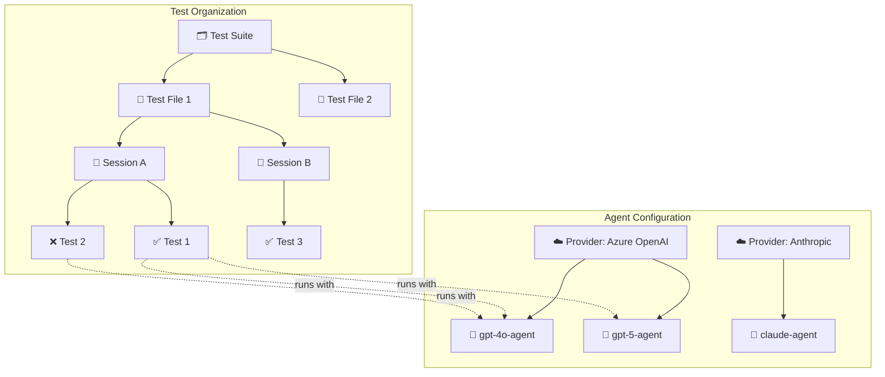
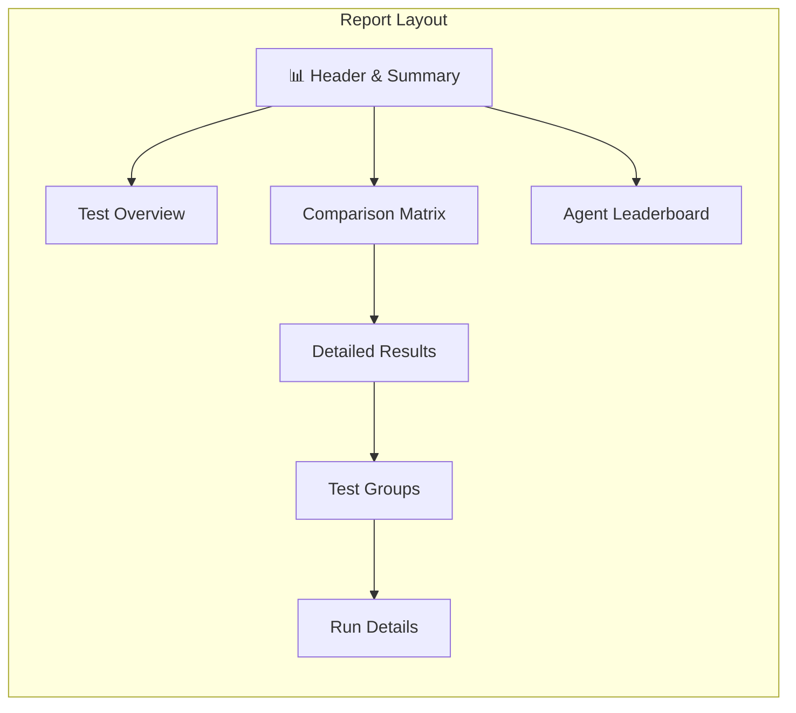

# Report Generation

Agent Benchmark generates rich HTML reports that visualize your test results with interactive elements, comparison matrices, and detailed execution traces.

## Report Hierarchy

The report organizes results in a hierarchical structure that reflects how tests are configured and executed:



### Test Organization Hierarchy

| Level | Description | Example |
|-------|-------------|---------|
| **Suite** | Top-level collection defined in a suite YAML file | `test-suite.yaml` with multiple test files |
| **File** | Individual test configuration file | `windows-mcp-notepad.yaml` |
| **Session** | Logical grouping of related tests within a file | "Notepad Workflow", "Setup Tasks" |
| **Test** | Single test case with prompt and assertions | "Complete Notepad automation" |

### Agent Configuration Hierarchy

| Level | Description | Example |
|-------|-------------|---------|
| **Provider** | LLM service with credentials and rate limits | Azure OpenAI, Anthropic, Google |
| **Agent** | Named configuration using a provider + MCP servers | `gpt5-agent` using `azure-openai-gpt5` provider |

## Report Sections



### 1. Summary Cards

Quick overview of test execution:
- **Total Tests** - Number of test runs
- **Passed/Failed** - Success and failure counts
- **Pass Rate** - Overall success percentage
- **Agents** - Number of agents tested (multi-agent runs)
- **Avg Tokens** - Average tokens used by passing tests
- **Avg Duration** - Average test execution time

### 2. Comparison Matrix (Multi-Agent)

When testing multiple agents, a matrix shows results at a glance. The matrix **adapts automatically** based on your test structure:

**Simple (single file, single session):**
| Test | gpt5-agent | gpt4o-agent |
|------|------------|-------------|
| Setup workspace | ✅ 8.5s | ✅ 12.0s |
| Run automation | ✅ 5.2s | ❌ — |

**Grouped (multiple sessions):**
| Test | gpt5-agent | gpt4o-agent |
|------|------------|-------------|
| 🔄 Session A | | |
| &nbsp;&nbsp;&nbsp;&nbsp;Setup | ✅ 8.5s | ✅ 12.0s |
| &nbsp;&nbsp;&nbsp;&nbsp;Cleanup | ✅ 2.0s | ✅ 3.1s |
| 🔄 Session B | | |
| &nbsp;&nbsp;&nbsp;&nbsp;Setup | ✅ 4.2s | ❌ — |

**Fully Grouped (suite with multiple files and sessions):**
| Test | gpt5-agent | gpt4o-agent |
|------|------------|-------------|
| 📁 test-file-1.yaml | | |
| &nbsp;&nbsp;🔄 Session A | | |
| &nbsp;&nbsp;&nbsp;&nbsp;Setup | ✅ 8.5s | ✅ 12.0s |
| 📁 test-file-2.yaml | | |
| &nbsp;&nbsp;🔄 Session B | | |
| &nbsp;&nbsp;&nbsp;&nbsp;Deploy | ✅ 5.1s | ✅ 6.3s |

Each cell shows: **status**, **duration**, and **token count**.

### 3. Agent Leaderboard (Multi-Agent)

Agents ranked by performance:

| Rank | Agent | Success Rate | Efficiency | Avg Time |
|------|-------|--------------|------------|----------|
| 🥇 | gpt5-agent | 100% | 456 tok/✓ | 6.8s |
| 🥈 | claude-agent | 75% | 589 tok/✓ | 10.2s |
| 🥉 | gpt4o-agent | 50% | 723 tok/✓ | 12.0s |

### 4. Detailed Test Results

Each test shows:
- **Assertions** - Pass/fail status for each assertion
- **Tool Calls** - Timeline of MCP tool invocations with parameters and results
- **Sequence Diagram** - Visual flow of User → Agent → MCP Server interactions
- **Messages** - Full conversation history
- **Final Output** - Agent's final response

### 5. Rate Limit & Clarification Stats

When enabled, the report shows:
- **Throttle Count** - Times request was proactively delayed
- **429 Hits** - Rate limit errors received
- **Retry Stats** - Retry attempts and wait times
- **Clarification Requests** - Times agent asked for confirmation instead of acting

## Adaptive Display

The report automatically adapts based on your test configuration:

| Scenario | What's Shown |
|----------|--------------|
| Single agent, single test | Detailed view with full execution trace |
| Single agent, multiple tests | Test overview table + detailed results |
| Multiple agents, same tests | Comparison matrix + leaderboard + details |
| Multiple sessions | Session grouping with per-session stats |
| Suite run (multiple files) | File grouping with per-file stats |

## How Tests with Same Names are Handled

When the same test name appears in different sessions or files, the report correctly groups them separately:

```yaml
# File: test-a.yaml
sessions:
  - name: Session 1
    tests:
      - name: "Setup"  # ← Unique: "Setup|session:Session 1|file:test-a.yaml"

  - name: Session 2  
    tests:
      - name: "Setup"  # ← Unique: "Setup|session:Session 2|file:test-a.yaml"
```

The display shows just "Setup" but internally each is tracked separately for accurate statistics.

## Generated Files

Reports can be output in multiple formats:

| Format | Flag | Description |
|--------|------|-------------|
| HTML | `-reportType html` | Interactive report with all visualizations |
| JSON | `-reportType json` | Raw data for programmatic processing |
| Both | `-reportType html,json` | Generate both formats |

Example:
```bash
go run . -f examples/test.yaml -reportType html,json
```

