# Report Generation

Agent Benchmark generates rich HTML reports that visualize your test results with interactive elements, comparison matrices, and detailed execution traces.

## Report Hierarchy

The report organizes results in a hierarchical structure that reflects how tests are configured and executed:

```mermaid
graph TD
    subgraph "Test Organization"
        Suite[🗂️ Test Suite]
        Suite --> File1[📄 Test File 1]
        Suite --> File2[📄 Test File 2]
        File1 --> Session1[🔄 Session A]
        File1 --> Session2[🔄 Session B]
        Session1 --> Test1[✅ Test 1]
        Session1 --> Test2[❌ Test 2]
        Session2 --> Test3[✅ Test 3]
    end

    subgraph "Agent Configuration"
        Provider1[☁️ Provider: Azure OpenAI]
        Provider2[☁️ Provider: Anthropic]
        Provider1 --> Agent1[🤖 gpt-4o-agent]
        Provider1 --> Agent2[🤖 gpt-5-agent]
        Provider2 --> Agent3[🤖 claude-agent]
    end

    Test1 -.->|runs with| Agent1
    Test1 -.->|runs with| Agent2
    Test2 -.->|runs with| Agent1
```



### Test Organization Hierarchy

| Level | Description | Example |
|-------|-------------|---------|
| **Suite** | Top-level collection defined in a suite YAML file | `test-suite.yaml` with multiple test files |
| **File** | Individual test configuration file | `windows-mcp-notepad.yaml` |
| **Session** | Logical grouping of related tests within a file | "Notepad Workflow", "Setup Tasks" |
| **Test** | Single test case with prompt and assertions | "Complete Notepad automation" |

### Agent Configuration Hierarchy

| Level | Description | Example |
|-------|-------------|---------|
| **Provider** | LLM service with credentials and rate limits | Azure OpenAI, Anthropic, Google |
| **Agent** | Named configuration using a provider + MCP servers | `gpt5-agent` using `azure-openai-gpt5` provider |

## Sample Reports

The `generated_reports/` directory contains sample reports covering all valid configuration permutations:

| Report | Agents | Tests/Session | Sessions | Files | Description |
|--------|--------|---------------|----------|-------|-------------|
| `01_single_agent_single_test` | 1 | 1 | 1 | 1 | Minimal case - direct detailed view (SingleTestMode) |
| `02_single_agent_multi_test` | 1 | N | 1 | 1 | Test overview table |
| `03_single_agent_multi_session` | 1 | 2 | 2 | 1 | Session grouping with flow diagrams |
| `04_single_agent_multi_file` | 1 | 2 | 2 | 2 | File + session grouping with flow diagrams |
| `05_multi_agent_single_test` | 3 | 1 | 1 | 1 | Agent leaderboard focus (SingleTestMode) |
| `06_multi_agent_multi_test` | 3 | N | 1 | 1 | Full comparison matrix |
| `07_multi_agent_multi_session` | 3 | 2-3 | 3 | 1 | Session overview tables + side-by-side sequences |
| `08_multi_agent_multi_file` | 3 | 2 | 2 | 2 | Complete suite with file + session grouping |
| `09_failed_with_errors` | 1 | 1 | 1 | 1 | Failed test showing rate limits & clarifications |

Generate these samples with:
```bash
go run test/generate_reports.go
```

## Report Sections


### 1. Summary Cards

Quick overview of test execution:
- **Total Tests** - Number of test runs
- **Passed/Failed** - Success and failure counts
- **Pass Rate** - Overall success percentage
- **Agent Info** - Agent name and provider badge (single-agent runs)
- **Agents** - Number of agents tested (multi-agent runs)
- **Sessions** - Number of sessions (shown when > 1)
- **Total Tokens/Duration** - Aggregate metrics (single-agent runs only)
- **Token Range** - Min–max tokens across tests with sparkline (shown when multiple tests)
- **Duration Range** - Min–max duration across tests with sparkline (shown when multiple tests)

> **Note:** For multi-agent runs, totals are omitted since summing across agents isn't meaningful for comparison. Instead, ranges show the variance between fastest/slowest or cheapest/most expensive runs.

### 2. AI Summary

When `ai_summary` is enabled in your test YAML, an LLM-generated executive summary appears after the summary cards.

#### Late-Binding Architecture

AI summaries use a **late-binding** approach:

1. **JSON output is pure test data** - The `ai_summary` is never stored in JSON
2. **Fresh generation at report time** - AI summary is generated when creating HTML/MD reports
3. **Iteration-friendly** - Regenerate reports with updated prompts without re-running tests

This design enables rapid iteration on AI summary quality without expensive test re-runs.

#### Configuration

Add `ai_summary` to your test or suite YAML:

```yaml
ai_summary:
  enabled: true
  judge_provider: azure-gpt  # Provider name for generating the analysis
```

**Configuration Options:**

| Option | Description | Required |
|--------|-------------|----------|
| `enabled` | Enable AI summary | Yes |
| `judge_provider` | Provider name for the analysis LLM (must be defined in `providers` section) | Yes (when enabled) |

**Example Configuration:**

```yaml
providers:
  - name: azure-gpt
    type: AZURE
    auth_type: entra_id
    model: gpt-4
    baseUrl: https://your-resource.openai.azure.com
    version: 2024-02-15-preview

ai_summary:
  enabled: true
  judge_provider: azure-gpt  # Use the azure-gpt provider for analysis

agents:
  - name: test-agent
    provider: azure-gpt
    # ...
```

#### What's Included

The AI summary provides interpretation-focused analysis:

- **Verdict** - Clear recommendation with confidence level: "Use Agent X" with justification
- **Trade-offs** - Most accurate, most cost-effective, and agents to avoid
- **Notable Observations** - Unexpected positives (✅) and passing-but-risky patterns (⚠️)
- **Failure Analysis** - Patterns grouped by root cause (test quality, tool issues, agent behavior)
- **Recommendations** - 2-3 actionable items to improve results

#### Output Formats

**HTML Reports:** The analysis appears as an "AI Summary" section after the summary cards.

**JSON Reports:** JSON contains a `test_file` field pointing to the original YAML. The `ai_summary` is **not** stored in JSON - it is generated fresh when creating HTML/MD reports:

```json
{
  "test_file": "path/to/test.yaml",
  "detailed_results": [...],
  "summary": {...}
}
```

#### Regenerating Reports

Regenerate HTML reports from existing JSON results:

```bash
# Reads test_file from JSON to load AI summary configuration
agent-benchmark -generate-report results.json -o new-report.html
```

This is useful when:
- You want to try different AI summary prompts
- The original AI summary failed due to rate limits
- You want to use a different model for analysis

📖 **[Full AI Summary Documentation](../docs/ai-summary.md)**

### 3. File & Session Grouping

When running suites or multi-session tests, hierarchical grouping is applied:

**File Summary Section** (files > 1):
- Per-file pass rate, duration, and token usage
- Expandable to show contained sessions

**Detailed Results Hierarchy**:
Sessions are rendered as visual containers that clearly group related tests:

```
┌─────────────────────────────────────────────────────────┐
│ 🔄 Setup    5/6 (83%)  ⏱ 1.5s–2.0s  🔢 180–280tok      │
│                                                         │
│  📊 Session Overview — Agent Comparison                 │
│  ┌─────────────────────────────────────────────────┐   │
│  │ Metric    │ claude  │ gemini  │ gpt-agent       │   │
│  │ Pass Rate │ 2/2     │ 2/2     │ 1/2 (50%)       │   │
│  │ Duration  │ 1.5–2.0s│ 1.5–2.0s│ 1.5–2.0s        │   │
│  │ Tokens    │ 180–220 │ 200–250 │ 220–280         │   │
│  └─────────────────────────────────────────────────┘   │
│                                                         │
│  ▶ 📊 View Session Flow (3 agents)                     │
│                                                         │
│  ────────────────────────────────────────────────────  │
│  📋 Tests in this session                              │
│  │                                                      │
│  │  Create workspace                                    │
│  │  ├── Agent comparison table...                       │
│  │                                                      │
│  │  Initialize config                                   │
│  │  ├── Agent comparison table...                       │
└──┴──────────────────────────────────────────────────────┘
```

**Session Header** contains:
- Title with aggregate stats (pass rate, duration range, token range)
- **Session Overview Table** (multi-agent only) — Per-agent comparison at session level
- **Session Flow Diagrams** — Collapsible Mermaid sequence diagrams

**Tests Section** contains:
- Clear "📋 Tests in this session" label
- Indented test items with left border showing hierarchy
- Per-test comparison tables (same format as session overview)

> **Note:** Session overview shows ranges (min–max) rather than totals, since totals across agents aren't meaningful for comparison.

### 4. Comparison Matrix (Multi-Agent)

When testing multiple agents, a matrix shows results at a glance. The matrix **adapts automatically** based on your test structure:

**Simple (single file, single session):**

| Test | gpt5-agent | gpt4o-agent |
|------|------------|-------------|
| Setup workspace | ✅ 8.5s 456 | ✅ 12.0s 589 |
| Run automation | ✅ 5.2s 234 | ❌ — |

**Grouped (multiple sessions):**

| Session | gpt5-agent | gpt4o-agent |
|---------|------------|-------------|
| 🔄 Setup — 4/4 passed · 1.5s–2.0s · 180–280 tok | | |
|     Create workspace | ✅ 1.5s 180 | ✅ 2.0s 220 |
|     Initialize config | ✅ 1.8s 200 | ✅ 1.9s 250 |
| 🔄 Cleanup — 1/2 passed · 1.2s–1.5s · 140–180 tok | | |
|     Delete files | ✅ 1.2s 140 | ⌠— |

Each cell shows: **status**, **duration**, and **token count**.

Session headers show: **pass count** and **ranges** (duration min–max, token min–max).

> **Note:** Headers display ranges instead of totals because totals aggregate across agents, which isn't useful for comparison. Ranges show variance: "fastest agent took 1.5s, slowest took 2.0s".

### 5. Agent Leaderboard (Multi-Agent)

Agents ranked by performance:

| Rank | Agent | Success Rate | Efficiency | Avg Time |
|------|-------|--------------|------------|----------|
| 🥇 | gpt5-agent | 100% | 456 tok/✓ | 6.8s |
| 🥈 | claude-agent | 75% | 589 tok/✓ | 10.2s |
| 🥉 | gpt4o-agent | 50% | 723 tok/✓ | 12.0s |

### 6. Detailed Test Results

Each test shows:
- **Assertions** - Pass/fail status for each assertion
- **Tool Calls** - Timeline of MCP tool invocations with parameters and results
- **Sequence Diagram** - Visual execution flow (single-agent: inline; multi-agent: side-by-side with click-to-expand)
- **Messages** - Full conversation history
- **Final Output** - Agent's final response

### 7. Rate Limit & Clarification Stats

When enabled, the report shows:
- **Throttle Count** - Times request was proactively delayed
- **429 Hits** - Rate limit errors received
- **Retry Stats** - Retry attempts and wait times
- **Clarification Requests** - Times agent asked for confirmation instead of acting

## Adaptive Display

The report automatically adapts based on your test configuration.

### Section Visibility Rules

Each report section is shown or hidden based on specific conditions:

| Section | Condition | Description |
|---------|-----------|-------------|
| **Comparison Matrix** | agents > 1 | Grid comparing all agents across all tests |
| **Agent Leaderboard** | agents > 1 | Ranked list of agents by performance |
| **Test Overview** | tests > 1 AND agents = 1 | Summary table of all tests for single agent |
| **File Headers** | files > 1 | Group tests by source file |
| **Session Headers** | sessions > 1 | Group tests by session within files (in Detailed Results) |
| **Sessions Meta** | sessions > 1 | Show "🔄 Sessions: N" in header metadata |
| **Inline Agent Names** | agents > 1 | Show agent name in each test detail row |
| **SingleTestMode** | tests = 1 | Skip Test Overview table, show details directly |
| **Sequence Diagrams** | always | Single-agent: inline; Multi-agent: side-by-side comparison |

### Display Scenarios

| Scenario | What's Shown |
|----------|--------------|
| Single agent, single test | Agent info card + detailed execution trace (SingleTestMode: no overview table) |
| Single agent, multiple tests | Agent info + test overview table |
| Single agent, multiple sessions | Session grouping with stats in Detailed Results headers |
| Multiple agents, single test | Comparison matrix + leaderboard (SingleTestMode: no overview table) |
| Multiple agents, multiple tests | Full comparison matrix + leaderboard |
| Multiple agents, multiple sessions | Session grouping in matrix and Detailed Results with stats in headers |
| Suite run (multiple files) | File → Session hierarchy with aggregated stats in group headers |

### Grouping Rules

Tests are grouped hierarchically when multiple files or sessions exist:

| Report Section | files > 1 | sessions > 1 | Result |
|----------------|-----------|--------------|--------|
| **Comparison Matrix** | Group by file | Group by session | File → Session → Test hierarchy |
| **Test Overview** | Group by file | Group by session | File → Session → Test hierarchy |
| **Detailed Results** | Show file headers | Show session headers | Collapsible sections per file/session |

**Grouping Hierarchy:**

| Files | Sessions | Hierarchy |
|-------|----------|-----------|
| 1 | 1 | Tests (flat list) |
| 1 | N | Session → Tests |
| N | 1 per file | File → Tests |
| N | N | File → Session → Tests |

> **Note:** When a dimension has only one value (single file or single session), its header is omitted to reduce visual clutter.

### Group Header Statistics

File and session group headers in the Comparison Matrix display:

| Statistic | Description | Example |
|-----------|-------------|--------|
| **Pass Count** | Tests passed / total in group | `3/4 passed` |
| **Duration Range** | Min–max duration across all runs in group | `1.5s–2.5s` |
| **Token Range** | Min–max tokens across all runs in group | `180–520 tok` |

Ranges show variance between agents, helping identify which sessions have consistent or variable performance across agents.

### Sequence Diagram Display

Sequence diagrams visualize the User → Agent → MCP Server interaction flow with test results:

**Diagram Features:**
- **Colored backgrounds** — Green for passed tests, red for failed tests
- **Test headers with metrics** — Each test shows: name, status (✅/❌), duration, and token count
- **Tool call timings** — Individual tool execution times in milliseconds

Example diagram structure:
```
┌─────────────────────────────────────────────────────────┐
│  rect rgb(40, 167, 69)  [green for passed]              │
│  note: Test 1 - Create workspace ✅ (1.5s · 180 tok)    │
│      User ->> Agent: Create a workspace...              │
│      Agent ->> MCP Server: write_file() [45ms]          │
│      MCP Server -->> Agent: result                      │
│      Agent -->> User: Workspace created                 │
│  end                                                    │
│                                                         │
│  rect rgb(220, 53, 69)  [red for failed]                │
│  note: Test 2 - Initialize config ❌ (2.0s · 280 tok)   │
│      ...                                                │
│  end                                                    │
└─────────────────────────────────────────────────────────┘
```

| Location | Single Agent | Multi-Agent |
|----------|--------------|-------------|
| **Session Summary** | One aggregate diagram per session | Per-agent diagrams in side-by-side grid |
| **Test Details** | Inline diagram | Side-by-side grid comparing all agents |

**Interaction:**
- All diagrams are **click-to-expand** — click any diagram to view it fullscreen for detailed inspection
- Hover shows "🔍 Click to enlarge" hint
- Press **Escape** or click outside to close fullscreen view

The side-by-side view enables quick visual comparison of how different agents approached the same task, with color-coded pass/fail status making issues immediately visible.

### Execution Order

All report sections maintain **execution order** — items appear in the order they were executed, not alphabetically:

- **Files** — ordered by first test execution within each file
- **Sessions** — ordered by first test execution within each session
- **Tests** — ordered by execution sequence within their session
- **Agents** — ordered by first test run for each agent

This ensures the report reflects the actual test flow, making it easier to trace issues.


## How Tests with Same Names are Handled

When the same test name appears in different sessions or files, the report correctly groups them separately:

```yaml
# File: test-a.yaml
sessions:
  - name: Session 1
    tests:
      - name: "Setup"  # ← Unique: "Setup|session:Session 1|file:test-a.yaml"

  - name: Session 2  
    tests:
      - name: "Setup"  # ← Unique: "Setup|session:Session 2|file:test-a.yaml"
```

The display shows just "Setup" but internally each is tracked separately for accurate statistics.

## Generated Files

Reports can be output in multiple formats:

| Format | Flag | Description |
|--------|------|-------------|
| HTML | `-reportType html` | Interactive report with all visualizations |
| JSON | `-reportType json` | Raw data for programmatic processing |
| Both | `-reportType html,json` | Generate both formats |

Example:
```bash
go run . -f examples/test.yaml -reportType html,json
```

To enable LLM-generated summary, configure `ai_summary` in your test YAML:

```yaml
ai_summary:
  enabled: true
  judge_provider: your-provider-name
```

