# Report Generation

Agent Benchmark generates rich HTML reports that visualize your test results with interactive elements, comparison matrices, and detailed execution traces.

## Report Hierarchy

The report organizes results in a hierarchical structure that reflects how tests are configured and executed:

```mermaid
graph TD
    subgraph "Test Organization"
        Suite[🗂️ Test Suite]
        Suite --> File1[📄 Test File 1]
        Suite --> File2[📄 Test File 2]
        File1 --> Session1[🔄 Session A]
        File1 --> Session2[🔄 Session B]
        Session1 --> Test1[✅ Test 1]
        Session1 --> Test2[❌ Test 2]
        Session2 --> Test3[✅ Test 3]
    end

    subgraph "Agent Configuration"
        Provider1[☁️ Provider: Azure OpenAI]
        Provider2[☁️ Provider: Anthropic]
        Provider1 --> Agent1[🤖 gpt-4o-agent]
        Provider1 --> Agent2[🤖 gpt-5-agent]
        Provider2 --> Agent3[🤖 claude-agent]
    end

    Test1 -.->|runs with| Agent1
    Test1 -.->|runs with| Agent2
    Test2 -.->|runs with| Agent1
```



### Test Organization Hierarchy

| Level | Description | Example |
|-------|-------------|---------|
| **Suite** | Top-level collection defined in a suite YAML file | `test-suite.yaml` with multiple test files |
| **File** | Individual test configuration file | `windows-mcp-notepad.yaml` |
| **Session** | Logical grouping of related tests within a file | "Notepad Workflow", "Setup Tasks" |
| **Test** | Single test case with prompt and assertions | "Complete Notepad automation" |

### Agent Configuration Hierarchy

| Level | Description | Example |
|-------|-------------|---------|
| **Provider** | LLM service with credentials and rate limits | Azure OpenAI, Anthropic, Google |
| **Agent** | Named configuration using a provider + MCP servers | `gpt5-agent` using `azure-openai-gpt5` provider |

## Sample Reports

The `generated_reports/` directory contains sample reports covering all valid configuration permutations:

| Report | Agents | Tests | Sessions | Files | Description |
|--------|--------|-------|----------|-------|-------------|
| `01_single_agent_single_test` | 1 | 1 | 1 | 1 | Minimal case - detailed execution view |
| `02_single_agent_multi_test` | 1 | N | 1 | 1 | Test overview table |
| `03_single_agent_multi_session` | 1 | N | N | 1 | Session grouping with flow diagrams |
| `04_single_agent_multi_file` | 1 | N | N | N | File grouping with flow diagrams |
| `05_multi_agent_single_test` | N | 1 | 1 | 1 | Agent leaderboard focus |
| `06_multi_agent_multi_test` | N | N | 1 | 1 | Full comparison matrix |
| `07_multi_agent_multi_session` | N | N | N | 1 | Session grouping + side-by-side sequences |
| `08_multi_agent_multi_file` | N | N | N | N | Complete suite with file + session grouping |
| `09_failed_with_errors` | 1 | 1 | 1 | 1 | Failed test with rate limits & clarifications |

Generate these samples with:
```bash
go run test/generate_reports.go
```

## Report Sections

```mermaid
graph LR
    subgraph "Report Layout"
        Header[📊 Header & Summary]
        Header --> Overview[Test Overview]
        Header --> Matrix[Comparison Matrix]
        Header --> Leaderboard[Agent Leaderboard]
        Matrix --> Details[Detailed Results]
        Details --> TestGroup[Test Groups]
        TestGroup --> RunDetails[Run Details]
    end
```



### 1. Summary Cards

Quick overview of test execution:
- **Total Tests** - Number of test runs
- **Passed/Failed** - Success and failure counts
- **Pass Rate** - Overall success percentage
- **Agent Info** - Agent name and provider badge (single-agent runs)
- **Agents** - Number of agents tested (multi-agent runs)
- **Avg Tokens** - Average tokens used by passing tests
- **Avg Duration** - Average test execution time

### 2. AI Summary

When `ai_summary` is enabled in your test YAML, an LLM-generated executive summary appears after the summary cards.

#### Configuration

Add `ai_summary` to your test or suite YAML:

```yaml
ai_summary:
  enabled: true
  judge_provider: azure-gpt  # Provider name for generating the analysis
```

**Configuration Options:**

| Option | Description | Required |
|--------|-------------|----------|
| `enabled` | Enable AI summary | Yes |
| `judge_provider` | Provider name for the analysis LLM (must be defined in `providers` section) | Yes (when enabled) |

**Example Configuration:**

```yaml
providers:
  - name: azure-gpt
    type: AZURE
    auth_type: entra_id
    model: gpt-4
    baseUrl: https://your-resource.openai.azure.com
    version: 2024-02-15-preview

ai_summary:
  enabled: true
  judge_provider: azure-gpt  # Use the azure-gpt provider for analysis

agents:
  - name: test-agent
    provider: azure-gpt
    # ...
```

#### What's Included

The AI summary provides interpretation-focused analysis:

- **Verdict** - Clear recommendation with confidence level: "Use Agent X" with justification
- **Trade-offs** - Most accurate, most cost-effective, and agents to avoid
- **Notable Observations** - Unexpected positives (✅) and passing-but-risky patterns (⚠️)
- **Failure Analysis** - Patterns grouped by root cause (test quality, tool issues, agent behavior)
- **Recommendations** - 2-3 actionable items to improve results

#### Output Formats

**HTML Reports:** The analysis appears as an "AI Summary" section after the summary cards.

**JSON Reports:** The analysis is included in the `ai_summary` field:

```json
{
  "ai_summary": {
    "success": true,
    "analysis": "### Verdict\n\n**Use Agent X** - 95% pass rate with best efficiency..."
  }
}
```

### 3. File & Session Summary

When running suites or multi-session tests, summary sections show:
- **File Summary** - Per-file pass rate, duration, and token usage
- **Session Summary** - Per-session stats with source file reference
- **Session Flow Diagram** - Mermaid sequence diagram showing execution flow
  - **Single-agent**: One aggregate diagram for the session
  - **Multi-agent**: Per-agent diagrams in a side-by-side grid (click any diagram to view fullscreen)

### 4. Comparison Matrix (Multi-Agent)

When testing multiple agents, a matrix shows results at a glance. The matrix **adapts automatically** based on your test structure:

**Simple (single file, single session):**
| Test | gpt5-agent | gpt4o-agent |
|------|------------|-------------|
| Setup workspace | ✅ 8.5s | ✅ 12.0s |
| Run automation | ✅ 5.2s | ❌ — |

**Grouped (multiple sessions):**
| Test | gpt5-agent | gpt4o-agent |
|------|------------|-------------|
| 🔄 Session A — 4/4 passed · 15.6s · 890 tok | | |
| &nbsp;&nbsp;&nbsp;&nbsp;Setup | ✅ 8.5s | ✅ 12.0s |
| &nbsp;&nbsp;&nbsp;&nbsp;Cleanup | ✅ 2.0s | ✅ 3.1s |
| 🔄 Session B — 1/2 passed · 4.2s · 456 tok | | |
| &nbsp;&nbsp;&nbsp;&nbsp;Setup | ✅ 4.2s | ❌ — |

**Fully Grouped (suite with multiple files and sessions):**
| Test | gpt5-agent | gpt4o-agent |
|------|------------|-------------|
| 📁 test-file-1.yaml — 4/4 passed · 15.6s · 890 tok | | |
| &nbsp;&nbsp;🔄 Session A — 4/4 passed · 15.6s · 890 tok | | |
| &nbsp;&nbsp;&nbsp;&nbsp;Setup | ✅ 8.5s | ✅ 12.0s |
| 📁 test-file-2.yaml — 2/2 passed · 11.4s · 650 tok | | |
| &nbsp;&nbsp;🔄 Session B — 2/2 passed · 11.4s · 650 tok | | |
| &nbsp;&nbsp;&nbsp;&nbsp;Deploy | ✅ 5.1s | ✅ 6.3s |

Each cell shows: **status**, **duration**, and **token count**.

Group headers show: **pass count**, **total duration**, and **total tokens** (aggregated across all agents).

### 5. Agent Leaderboard (Multi-Agent)

Agents ranked by performance:

| Rank | Agent | Success Rate | Efficiency | Avg Time |
|------|-------|--------------|------------|----------|
| 🥇 | gpt5-agent | 100% | 456 tok/✓ | 6.8s |
| 🥈 | claude-agent | 75% | 589 tok/✓ | 10.2s |
| 🥉 | gpt4o-agent | 50% | 723 tok/✓ | 12.0s |

### 6. Detailed Test Results

Each test shows:
- **Assertions** - Pass/fail status for each assertion
- **Tool Calls** - Timeline of MCP tool invocations with parameters and results
- **Sequence Diagram** - Visual execution flow (single-agent: inline; multi-agent: side-by-side with click-to-expand)
- **Messages** - Full conversation history
- **Final Output** - Agent's final response

### 7. Rate Limit & Clarification Stats

When enabled, the report shows:
- **Throttle Count** - Times request was proactively delayed
- **429 Hits** - Rate limit errors received
- **Retry Stats** - Retry attempts and wait times
- **Clarification Requests** - Times agent asked for confirmation instead of acting

## Adaptive Display

The report automatically adapts based on your test configuration.

### Section Visibility Rules

Each report section is shown or hidden based on specific conditions:

| Section | Condition | Description |
|---------|-----------|-------------|
| **Comparison Matrix** | agents > 1 | Grid comparing all agents across all tests |
| **Agent Leaderboard** | agents > 1 | Ranked list of agents by performance |
| **Test Overview** | tests > 1 AND agents = 1 | Summary table of all tests for single agent |
| **File Headers** | files > 1 | Group tests by source file |
| **Session Headers** | sessions > 1 | Group tests by session within files |
| **Inline Agent Names** | agents > 1 | Show agent name in each test detail row |
| **Sequence Diagrams** | always | Single-agent: inline; Multi-agent: side-by-side comparison |

### Display Scenarios

| Scenario | What's Shown |
|----------|--------------|
| Single agent, single test | Agent info card + detailed execution trace |
| Single agent, multiple tests | Agent info + test overview table |
| Single agent, multiple sessions | Session summary with flow diagrams |
| Multiple agents, single test | Comparison matrix + leaderboard |
| Multiple agents, multiple tests | Full comparison matrix + leaderboard |
| Multiple agents, multiple sessions | Session grouping + side-by-side sequence comparison |
| Suite run (multiple files) | File + session grouping with per-file/session stats |

### Grouping Rules

Tests are grouped hierarchically when multiple files or sessions exist:

| Report Section | files > 1 | sessions > 1 | Result |
|----------------|-----------|--------------|--------|
| **Comparison Matrix** | Group by file | Group by session | File → Session → Test hierarchy |
| **Test Overview** | Group by file | Group by session | File → Session → Test hierarchy |
| **Detailed Results** | Show file headers | Show session headers | Collapsible sections per file/session |

**Grouping Hierarchy:**

| Files | Sessions | Hierarchy |
|-------|----------|-----------|
| 1 | 1 | Tests (flat list) |
| 1 | N | Session → Tests |
| N | 1 per file | File → Tests |
| N | N | File → Session → Tests |

> **Note:** When a dimension has only one value (single file or single session), its header is omitted to reduce visual clutter.

### Group Header Statistics

File and session group headers display aggregated statistics:

| Statistic | Description | Example |
|-----------|-------------|--------|
| **Pass Count** | Tests passed / total in group | `3/4 passed` |
| **Duration** | Sum of all test durations in group | `12.5s` |
| **Tokens** | Sum of all tokens used in group | `1,234 tok` |

For multi-agent runs, statistics are aggregated across all agents within the group.

### Sequence Diagram Display

Sequence diagrams visualize the User → Agent → MCP Server interaction flow:

| Location | Single Agent | Multi-Agent |
|----------|--------------|-------------|
| **Session Summary** | One aggregate diagram per session | Per-agent diagrams in side-by-side grid |
| **Test Details** | Inline diagram | Side-by-side grid comparing all agents |

**Interaction:**
- All diagrams are **click-to-expand** — click any diagram to view it fullscreen for detailed inspection
- Hover shows "🔍 Click to enlarge" hint
- Press **Escape** or click outside to close fullscreen view

The side-by-side view enables quick visual comparison of how different agents approached the same task.

### Execution Order

All report sections maintain **execution order** — items appear in the order they were executed, not alphabetically:

- **Files** — ordered by first test execution within each file
- **Sessions** — ordered by first test execution within each session
- **Tests** — ordered by execution sequence within their session
- **Agents** — ordered by first test run for each agent

This ensures the report reflects the actual test flow, making it easier to trace issues.


## How Tests with Same Names are Handled

When the same test name appears in different sessions or files, the report correctly groups them separately:

```yaml
# File: test-a.yaml
sessions:
  - name: Session 1
    tests:
      - name: "Setup"  # ← Unique: "Setup|session:Session 1|file:test-a.yaml"

  - name: Session 2  
    tests:
      - name: "Setup"  # ← Unique: "Setup|session:Session 2|file:test-a.yaml"
```

The display shows just "Setup" but internally each is tracked separately for accurate statistics.

## Generated Files

Reports can be output in multiple formats:

| Format | Flag | Description |
|--------|------|-------------|
| HTML | `-reportType html` | Interactive report with all visualizations |
| JSON | `-reportType json` | Raw data for programmatic processing |
| Both | `-reportType html,json` | Generate both formats |

Example:
```bash
go run . -f examples/test.yaml -reportType html,json
```

To enable LLM-generated summary, configure `ai_summary` in your test YAML:

```yaml
ai_summary:
  enabled: true
  judge_provider: your-provider-name
```

