# Report Generation

Agent Benchmark generates rich HTML reports that visualize your test results with interactive elements, comparison matrices, and detailed execution traces.

## Report Hierarchy

The report organizes results in a hierarchical structure that reflects how tests are configured and executed:

```mermaid
graph TD
    subgraph "Test Organization"
        Suite[🗂️ Test Suite]
        Suite --> File1[📄 Test File 1]
        Suite --> File2[📄 Test File 2]
        File1 --> Session1[🔄 Session A]
        File1 --> Session2[🔄 Session B]
        Session1 --> Test1[✅ Test 1]
        Session1 --> Test2[❌ Test 2]
        Session2 --> Test3[✅ Test 3]
    end

    subgraph "Agent Configuration"
        Provider1[☁️ Provider: Azure OpenAI]
        Provider2[☁️ Provider: Anthropic]
        Provider1 --> Agent1[🤖 gpt-4o-agent]
        Provider1 --> Agent2[🤖 gpt-5-agent]
        Provider2 --> Agent3[🤖 claude-agent]
    end

    Test1 -.->|runs with| Agent1
    Test1 -.->|runs with| Agent2
    Test2 -.->|runs with| Agent1
```



### Test Organization Hierarchy

| Level | Description | Example |
|-------|-------------|---------|
| **Suite** | Top-level collection defined in a suite YAML file | `test-suite.yaml` with multiple test files |
| **File** | Individual test configuration file | `windows-mcp-notepad.yaml` |
| **Session** | Logical grouping of related tests within a file | "Notepad Workflow", "Setup Tasks" |
| **Test** | Single test case with prompt and assertions | "Complete Notepad automation" |

### Agent Configuration Hierarchy

| Level | Description | Example |
|-------|-------------|---------|
| **Provider** | LLM service with credentials and rate limits | Azure OpenAI, Anthropic, Google |
| **Agent** | Named configuration using a provider + MCP servers | `gpt5-agent` using `azure-openai-gpt5` provider |

## Sample Reports

The `generated_reports/` directory contains sample reports covering all valid configuration permutations:

| Report | Agents | Tests | Sessions | Files | Description |
|--------|--------|-------|----------|-------|-------------|
| `01_single_agent_single_test` | 1 | 1 | 1 | 1 | Minimal case - detailed execution view |
| `02_single_agent_multi_test` | 1 | N | 1 | 1 | Test overview table |
| `03_multi_agent_single_test` | N | 1 | 1 | 1 | Agent leaderboard focus |
| `04_multi_agent_multi_test` | N | N | 1 | 1 | Full comparison matrix |
| `05_single_agent_multi_session` | 1 | N | N | 1 | Session grouping with flow diagrams |
| `06_multi_agent_multi_session` | N | N | N | 1 | Session grouping (no flow diagrams) |
| `07_single_agent_multi_file` | 1 | N | N | N | File grouping with flow diagrams |
| `08_multi_agent_multi_file` | N | N | N | N | Complete suite with file + session grouping |
| `09_failed_with_errors` | 1 | 1 | 1 | 1 | Failed test with rate limits & clarifications |

Generate these samples with:
```bash
go run test/generate_reports.go
```

## Report Sections


### 1. Summary Cards

Quick overview of test execution:
- **Total Tests** - Number of test runs
- **Passed/Failed** - Success and failure counts
- **Pass Rate** - Overall success percentage
- **Agent Info** - Agent name and provider badge (single-agent runs)
- **Agents** - Number of agents tested (multi-agent runs)
- **Avg Tokens** - Average tokens used by passing tests
- **Avg Duration** - Average test execution time

### 2. File & Session Summary

When running suites or multi-session tests, summary sections show:
- **File Summary** - Per-file pass rate, duration, and token usage
- **Session Summary** - Per-session stats with source file reference
- **Session Flow Diagram** - Mermaid sequence diagram (single-agent sessions only)

### 3. Comparison Matrix (Multi-Agent)

When testing multiple agents, a matrix shows results at a glance. The matrix **adapts automatically** based on your test structure:

**Simple (single file, single session):**
| Test | gpt5-agent | gpt4o-agent |
|------|------------|-------------|
| Setup workspace | ✅ 8.5s | ✅ 12.0s |
| Run automation | ✅ 5.2s | ❌ — |

**Grouped (multiple sessions):**
| Test | gpt5-agent | gpt4o-agent |
|------|------------|-------------|
| 🔄 Session A | | |
|     Setup | ✅ 8.5s | ✅ 12.0s |
|     Cleanup | ✅ 2.0s | ✅ 3.1s |
| 🔄 Session B | | |
|     Setup | ✅ 4.2s | ⌠— |

**Fully Grouped (suite with multiple files and sessions):**
| Test | gpt5-agent | gpt4o-agent |
|------|------------|-------------|
| 📁 test-file-1.yaml | | |
|   ğŸ”„ Session A | | |
|     Setup | ✅ 8.5s | ✅ 12.0s |
| 📁 test-file-2.yaml | | |
|   ğŸ”„ Session B | | |
|     Deploy | ✅ 5.1s | ✅ 6.3s |

Each cell shows: **status**, **duration**, and **token count**.

### 4. Agent Leaderboard (Multi-Agent)

Agents ranked by performance:

| Rank | Agent | Success Rate | Efficiency | Avg Time |
|------|-------|--------------|------------|----------|
| 🥇 | gpt5-agent | 100% | 456 tok/✓ | 6.8s |
| 🥈 | claude-agent | 75% | 589 tok/✓ | 10.2s |
| 🥉 | gpt4o-agent | 50% | 723 tok/✓ | 12.0s |

### 5. Detailed Test Results

Each test shows:
- **Assertions** - Pass/fail status for each assertion
- **Tool Calls** - Timeline of MCP tool invocations with parameters and results
- **Sequence Diagram** - Visual flow of User → Agent → MCP Server interactions
- **Messages** - Full conversation history
- **Final Output** - Agent's final response

### 6. Rate Limit & Clarification Stats

When enabled, the report shows:
- **Throttle Count** - Times request was proactively delayed
- **429 Hits** - Rate limit errors received
- **Retry Stats** - Retry attempts and wait times
- **Clarification Requests** - Times agent asked for confirmation instead of acting

## Adaptive Display

The report automatically adapts based on your test configuration:

| Scenario | What's Shown |
|----------|--------------|
| Single agent, single test | Agent info card + detailed execution trace |
| Single agent, multiple tests | Agent info + test overview table |
| Single agent, multiple sessions | Session summary with flow diagrams |
| Multiple agents, single test | Comparison matrix + leaderboard |
| Multiple agents, multiple tests | Full comparison matrix + leaderboard |
| Multiple agents, multiple sessions | Session grouping (no flow diagrams, shows agent count) |
| Suite run (multiple files) | File + session grouping with per-file/session stats |

## How Tests with Same Names are Handled

When the same test name appears in different sessions or files, the report correctly groups them separately:

```yaml
# File: test-a.yaml
sessions:
  - name: Session 1
    tests:
      - name: "Setup"  # ← Unique: "Setup|session:Session 1|file:test-a.yaml"

  - name: Session 2  
    tests:
      - name: "Setup"  # ← Unique: "Setup|session:Session 2|file:test-a.yaml"
```

The display shows just "Setup" but internally each is tracked separately for accurate statistics.

## Generated Files

Reports can be output in multiple formats:

| Format | Flag | Description |
|--------|------|-------------|
| HTML | `-reportType html` | Interactive report with all visualizations |
| JSON | `-reportType json` | Raw data for programmatic processing |
| Both | `-reportType html,json` | Generate both formats |

Example:
```bash
go run . -f examples/test.yaml -reportType html,json
```

